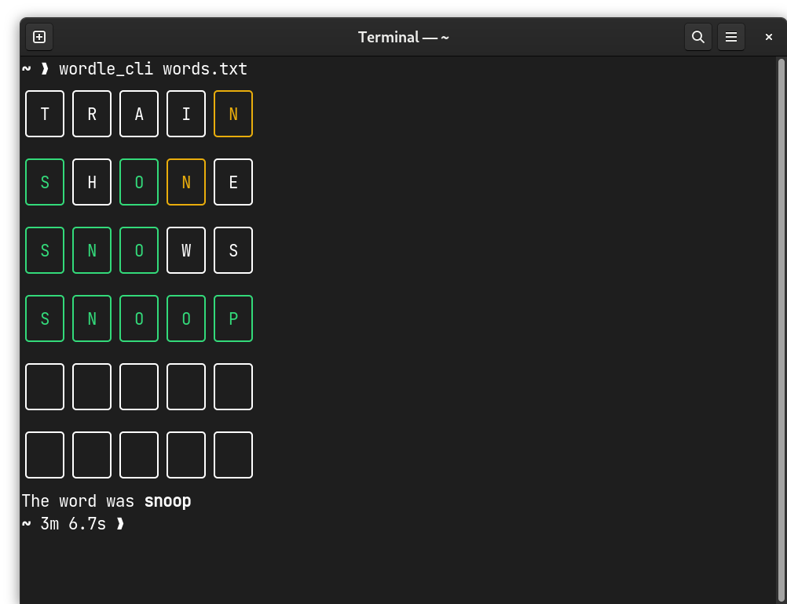

# Wordle CLI

A recreation of the popular online puzzle Wordle for your terminal!



## Install

```
git clone https://github.com/danielronalds/wordle_cli.git
cd wordle_cli
cargo install --path ./
```

Only tested on Fedora 37 Workstation Edition

## How to play

Before playing a game you will need a wordlist for wordle_cli to use. In this repo there are two 
which you can use. After installing run `wordle_cli <PATH_TO_WORDLIST>` and a random word will be 
selected. Valid guesses include any word from the wordlist provided, and guesses and words in the 
wordlist must be 5 letters long!

